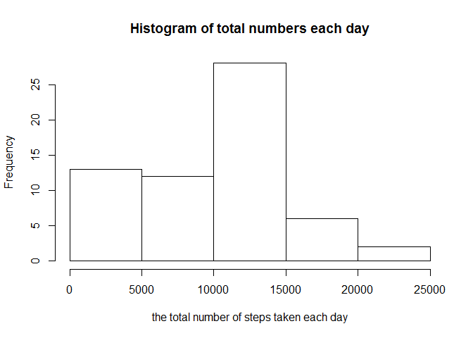
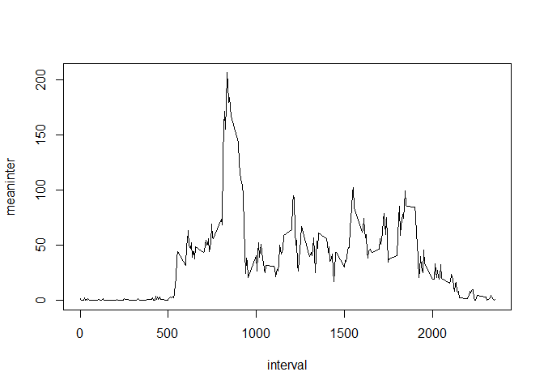
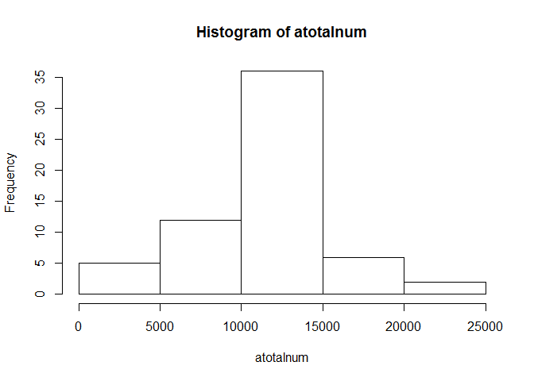
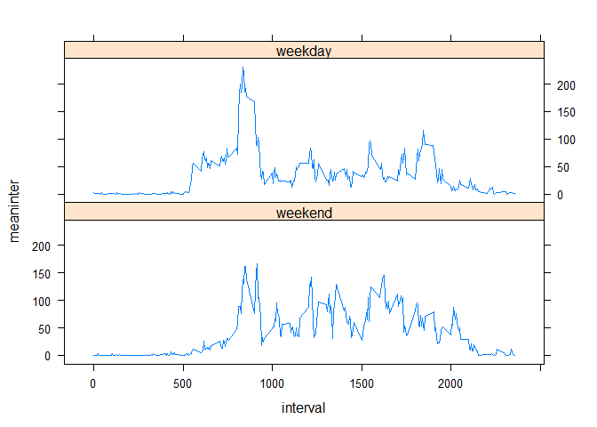

# Reproducible Research: Peer Assessment 1


## Loading and preprocessing the data
Using the following code to read the data.

```r
a<-read.csv(unz("activity.zip","activity.csv"),colClasses = c("numeric","Date","character"))
```
**a** is used to store our data.


## What is mean total number of steps taken per day?
The following graph gives a histogram of the total number of steps taken each day:

```r
totalnum<-tapply(a$steps,a$date,sum,na.rm=TRUE)
hist(totalnum,xlab = "the total number of steps taken each day",main="Histogram of total numbers each day")
```



```r
meantotal<-summary(totalnum)[4]
mediantotal<-summary(totalnum)[3]
meantotal
```

```
## Mean 
## 9354
```

```r
mediantotal
```

```
## Median 
##  10400
```
**totalmun** gives the total number of steps taken per day, which is a vector. **meantotal**  is the mean of steps taken per day, whereas **mediantotal** is the median of the total number of steps taken per day. As we  can see, the **mean** and **median** are **9354** and **10400** respectively. 


## What is the average daily activity pattern?
This is  a time series plot of the 5-minute interval (x-axis) and the average number of steps taken, averaged across all days (y-axis).

```r
meaninter<-tapply(a$steps,a$interval,mean,na.rm=TRUE)
dd<-data.frame(interval=as.numeric(names(meaninter)),meaninter)
plot(dd[order(dd$interval),],type="l")
```



```r
which.max(meaninter)
```

```
## 835 
## 272
```
From the result, we can see the maximum number of steps corresponds to **272** and **835** interval.


## Imputing missing values

```r
totaln<-sum(!complete.cases(a))
totaln
```

```
## [1] 2304
```

**totaln** gives the total number of missing values in the dataset which is **2304**. 

```r
#use the mean for that 5-minute interval to fill in the missing values
aa<-a
for (i in 1:nrow(aa)){
    if (is.na(aa[i,1])){
        aa[i,1]<-meaninter[aa[i,3]]
    }
}
```
Here, we use the mean for that 5-minute interval to fill in the missing values in our dataset. The new matrix is denoted as **aa**. 

```r
atotalnum<-tapply(aa$steps,aa$date,sum)
hist(atotalnum)
```



```r
ameantotal<-summary(atotalnum)[4]
amediantotal<-summary(atotalnum)[3]
```
The graph above gives a histogram of the total number of steps taken each day in our new dataset **aa**. From the result, we can see the mean and median have changed. After imputing the missing data in the original dataset **a**, the mean has increased by **10770** from 9354, while the median also has raised to **10770** from 10400. Moreover, the result reveals that imputting missing data has a great influence on the mean rather than the median, which is consistent to our sense.


## Are there differences in activity patterns between weekdays and weekends?


```r
library(lattice)
week<-character(nrow(aa))
for (i in 1:nrow(aa)){
    if (weekdays(aa$date[i])%in%c("星期日", "星期六"))
        week[i]="weekend"
    else
        week[i]="weekday"
}
bb<-cbind(aa,week)
bb1<-bb[bb$week=="weekend",]
bb2<-bb[bb$week=="weekday",]
meaninter1<-tapply(bb1$steps,bb1$interval,mean)
meaninter2<-tapply(bb2$steps,bb2$interval,mean)
dd1<-data.frame(interval=as.numeric(names(meaninter1)),meaninter=meaninter1,week=rep("weekend",length(meaninter1)))
dd2<-data.frame(interval=as.numeric(names(meaninter2)),meaninter=meaninter2,week=rep("weekday",length(meaninter2)))
ddd<-rbind(dd1[order(dd1$interval),],dd2[order(dd2$interval),])
xyplot(meaninter~interval|week,data=ddd,layout=c(1,2),panel = panel.lines)
```



**week** defines the new factor variable in the dataset with two levels – “weekday” and “weekend” indicating whether a given date is a weekday or weekend day. The figure above shows a panel plot containing a time series plot of the 5-minute interval (x-axis) and the average number of steps taken, averaged across all weekday days or weekend days (y-axis).

